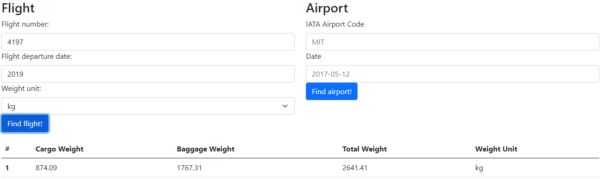
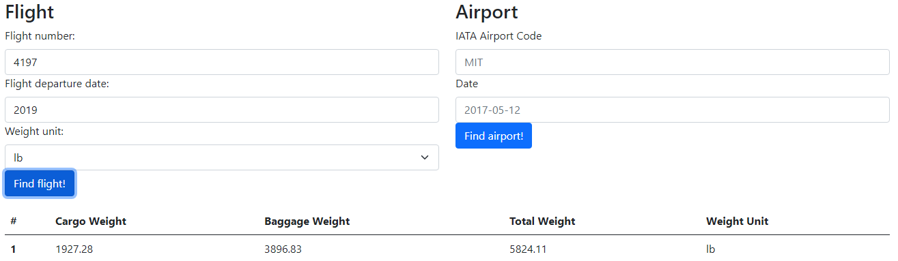

# AirportAPI

Recruit task.

Simple Spring based application calculating and showing airport and flight to user.

##BACKEND

## Endpoints

####GET #1
  
      For requested Flight Number and date will respond with following :
      
      a. Cargo Weight for requested Flight
      
      b. Baggage Weight for requested Flight
      
      c. Total Weight for requested Flight


* URL for flight data in kilos

http://localhost:8080/api/flights/details?number=4197&date=2019-05-27&unit=kg

* Will respond with the following:

```json
{
    "cargoWeight": 874.09,
    "baggageWeight": 1767.31,
    "totalWeight": 2641.41,
    "weightUnit": "kg"
}
```
* URL for flight data in pounds

http://localhost:8080/api/flights/details?number=4197&date=2019-05-27&unit=lb

* Will respond with the following:

```json
{
    "cargoWeight": 1927.28,
    "baggageWeight": 3896.83,
    "totalWeight": 5824.11,
    "weightUnit": "lb"
}
```
#
####GET #2

    For requested IATA Airport Code and date will respond with following :
    
    a. Number of flights departing from this airport,
    
    b. Number of flights arriving to this airport,
    
    c. Total number (pieces) of baggage arriving to this airport,
    
    d. Total number (pieces) of baggage departing from this airport.


* URL for airport data

http://localhost:8080/api/airport/details?iata=MIT&date=2019

* Will respond with the following:

```json
{
  "flightsDeparting": 0,
  "flightsArriving": 1,
  "piecesDeparting": 0,
  "piecesArriving": 3010
}
```


## FRONTEND
Simple front end to let user browse the data. Written in HTML5, jQuery and using Bootstrap.






